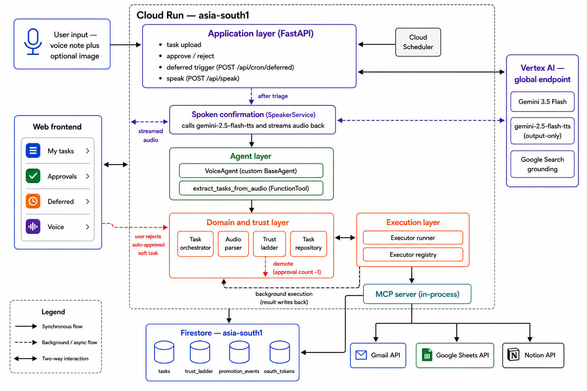
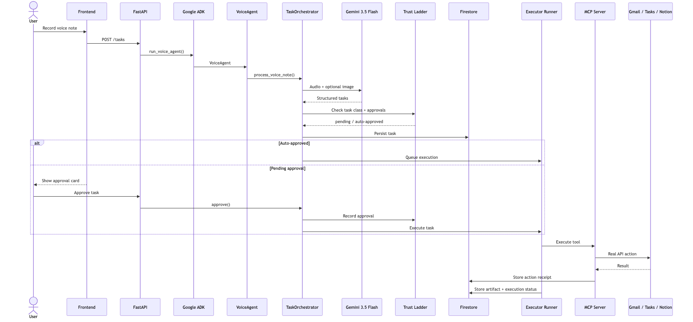

# Sollu: Voice-Note Errand Agent

Say it once — Sollu turns a voice note into triaged, executed tasks, decided by a
**trust ladder**: read-only tasks auto-run instantly, soft tasks (to-do, Notion) earn
auto-run per class after 3 approvals, hard tasks (email) never auto-run. Approval isn't a
checkbox — it runs a real executor and puts a real artifact on the card.

**Deployed:** <https://voice-agent-155260241110.asia-south1.run.app>

## Architecture



## Built With

| Layer | Choice |
|---|---|
| Reasoning (triage, extraction, every executor) | `gemini-3.5-flash` |
| Voice confirmation (spoken output) | `gemini-2.5-flash-tts` |
| Agent framework | `google-adk` — `src/agent.py`'s `VoiceAgent` sits on the live `POST /tasks` path |
| Compute + state | Cloud Run + Firestore Native, `asia-south1` |
| External actions | In-process MCP server → Gmail, Google Sheets, Notion |

---

## Agent Design



- `VoiceAgent` is a custom `google-adk` `BaseAgent`, not an `LlmAgent` — one voice note in, one deterministic triage pass out, so it directly invokes one `FunctionTool` and yields the result as an ADK `Event` rather than delegating a decision to an LLM at the orchestration layer. (`src/agent.py:47-58`)
- `run_voice_agent()` is the only ADK-facing entry point — it owns the Runner/session plumbing so `main.py` stays a thin HTTP adapter. (`src/agent.py:64-90`)
- Pipeline: parse (Gemini, audio → structured tasks) → triage (lane + class) → consult `TrustLadderEngine` → persist to Firestore → queue for execution.
- Execution is pluggable by manifest, not by code branch: `src/executors/registry.py` builds `KNOWN_CLASSES`/`EXECUTORS` straight from `intents.py` — adding a task class means adding one `TaskIntent` entry, not touching the pipeline.
- Per-task state machine: `pending_approval` → approve/reject → `executed`/`rejected`; `auto_approved` once the class's threshold is met — unless the task has an unresolved recipient, which overrides the threshold (see Edge Cases).

---

## Repository Structure

```
.
├── main.py
├── src/
│   ├── agent.py
│   ├── mcp_server.py
│   ├── domain/
│   │   ├── orchestrator.py
│   │   ├── parser.py
│   │   ├── trust_ladder.py
│   │   ├── executor_runner.py
│   │   ├── evaluator.py
│   │   ├── intents.py
│   │   ├── task_repo.py
│   │   ├── speaker.py
│   │   ├── vertex.py
│   │   └── logger.py
│   └── executors/
│       ├── mcp_executor.py
│       ├── gemini_executors.py
│       ├── price_executor.py
│       ├── base.py
│       └── registry.py
├── frontend/src/components/
├── tests/
├── scripts/
│   ├── ops/
│   ├── dev/
│   ├── eval/
│   └── fixtures/sample.wav
└── docs/submission.md
```

---

## Implementation Insights

- **Reversibility, not frequency, sets the threshold.** `TrustLadderEngine._get_threshold`: `0` read-only, `3` soft, `None` (never) hard — tracked per class in Firestore, so `add_todo_task` and `create_notion_page` earn trust independently. Hard tasks structurally can't promote, no matter how much trust accrues elsewhere.
- **Idempotency on real actions.** `McpExecutor` hashes `note + intent + args` per MCP call, so a retry can't double-send a real email.
- **Grounded search + schema compose** (numbers in Operational Metrics). `executor_runner._run_with_deadline` enforces a real wall-clock deadline itself — `HttpOptions.timeout` is an httpx read timeout, not one.
- **Grounding read from metadata, not prose.** The model's own `sources` field is a dead redirect link; real source is `grounding_metadata.grounding_chunks[].domain` (sometimes `None` — caught an IDC finding mislabeled "GOOGLE.COM").
- **Model region ≠ infra region.** `gemini-3.5-flash` isn't PAYG in `asia-south1`; called at the `global` endpoint while Cloud Run/Firestore stay regional.
- **Safety is the ladder, not a bolt-on.** Every class starts `pending_approval`; one rejection resets it to zero; `POST /api/cron/deferred` requires `X-Cron-Secret`; every step logs by `correlation_id`.
- **TTS is kept dumb.** Gets one finished sentence, never audio/transcript/task text; failure degrades silently to text.

---

## Operational Metrics

| Path | Median | Range |
|---|---|---|
| `parse_audio` locally | 4.2s | 3.8s – 80s (the 80s outlier is a local network issue, not the model) |
| `POST /tasks` end-to-end (Cloud Run) | 6.5s | 5.2s – 6.8s — covers upload, model call, 4 Firestore writes, ladder reads |
| Grounded research, with `response_schema` | 18.7s | — |
| Grounded research, without `response_schema` | 244s | — why the schema is mandatory, not optional |

- Token usage (audio/text/candidate/total) is logged on every task doc — cost per note is measured, not estimated.
- Cloud Run runs with `--min-instances=1`: auto-approved execution happens in a background task after the response, and a scaled-to-zero instance would silently drop that work.

---

## Monitoring & Governance

**Observability**
- Every step (note received, triage, ladder check, promotion/demotion, execution, etc.) logs a JSON event tagged with a `correlation_id` — one note's full lifecycle greps out in order. (`src/domain/logger.py`)
- `GET /health`, `/api/trust_ladder`, `/api/classes` show live status.
- Not there yet: tracing, metrics, dashboards, alerting. Logs are the whole story today.

**Governance**
- The trust ladder is the real control: hard tasks (email) never auto-run, one rejection resets a class to zero, and every real action is idempotency-keyed so a retry can't double-send.
- A hard cap of 3 model tool-calls per execution stops runaway loops. (`MAX_TOOL_CALLS`, `src/executors/base.py:17`)
- `approve` / `reject` / `delete` / submitting a note can be locked behind a shared secret (`API_SECRET`, opt-in). It's a basic gate, not real per-user login — the secret ships in the frontend code.
- Not there: rate limiting, CORS rules, per-user roles, or input filtering before a voice note reaches the executors. The trust ladder is the only real safety net.

---

## Where to Look

| Claim | Verify it here |
|---|---|
| ADK agent is on the live path | `main.py:92` → `src/agent.py:64` (`run_voice_agent`) → `:47` (`VoiceAgent`) |
| Reversibility-gated thresholds | `src/domain/trust_ladder.py:10-19` |
| Trust tracked per class | one Firestore doc per class; classes in `src/domain/intents.py` |
| MCP execution is real | `src/executors/mcp_executor.py` |
| No double-send on retry | `mcp_executor.py:24-33` (`_get_idempotency_key`), used at `:87` |
| Grounding from metadata | `gemini_executors.py:97-105` |
| Search + schema compose | `gemini_executors.py:59,84-86` |
| Real wall-clock deadline | `executor_runner.py:34-41` |
| Cron route is authenticated | `main.py:38,190` |
| Run the stability check first | `uv run python scripts/ops/positive_control.py --runs 5` |

## What Approval Actually Does

| Class | Executor | Real or stub |
|---|---|---|
| `send_email` | MCP (Gmail) | **real** |
| `add_todo_task` | MCP (Google Tasks) | **real** |
| `create_notion_page` | MCP (Notion) | **real** |
| `research` | Gemini + Google Search | **real, web-grounded** |
| `watch_price` | Deferred evaluator | **stubbed price source** |
| `other` | none | `no_executor` |

`GET /api/classes` exposes live executor status. Manual approval runs inline; auto-approval runs in the background.

---

## Setup (local)

**No setup:** use <https://voice-agent-155260241110.asia-south1.run.app>.

**Spine only:**
```bash
gcloud auth application-default login
# set GOOGLE_CLOUD_PROJECT in .env
uv run uvicorn main:app --reload --port 8080
```
Workspace actions degrade to a "Draft/Queued" simulation, not failure — the ladder's floor, not a gap. Upload `scripts/fixtures/sample.wav` to test without speaking.

**Full Workspace (real Gmail/Tasks):**
1. Web-app OAuth client in GCP, redirect URI `http://localhost:8080/oauth/callback`
2. Fill `.env` from `.env.example` (`GOOGLE_CLIENT_ID/SECRET`, `SETUP_PASSWORD`)
3. Visit `/oauth/start?password=<pw>`, authorize — token saved to Firestore

*Testing-status consent screens expire refresh tokens after 7 days; re-run `/oauth/start` if auth fails.*

```bash
cd frontend && npm install && npm run build && cd ..
uv run uvicorn main:app --reload --port 8080
# hot reload: cd frontend && npm run dev
```

## Deploy (Cloud Run)

```bash
uv export -o requirements.txt --no-hashes && sed -i '' '/^-e \.$/d' requirements.txt

gcloud run deploy voice-agent --source . --project <your-gcp-project> \
  --region asia-south1 --allow-unauthenticated \
  --set-env-vars GOOGLE_CLOUD_PROJECT=<your-gcp-project>,GOOGLE_CLOUD_LOCATION=asia-south1,GOOGLE_GENAI_USE_VERTEXAI=TRUE,CRON_SECRET=<your-secret>
```


## Testing

```bash
uv run python -m unittest discover -s tests             # unit tests
uv run python scripts/ops/positive_control.py --runs 5  # stability check: count+lane+class
uv run python scripts/eval/test_agent.py                # smoke test, full ADK path
```
