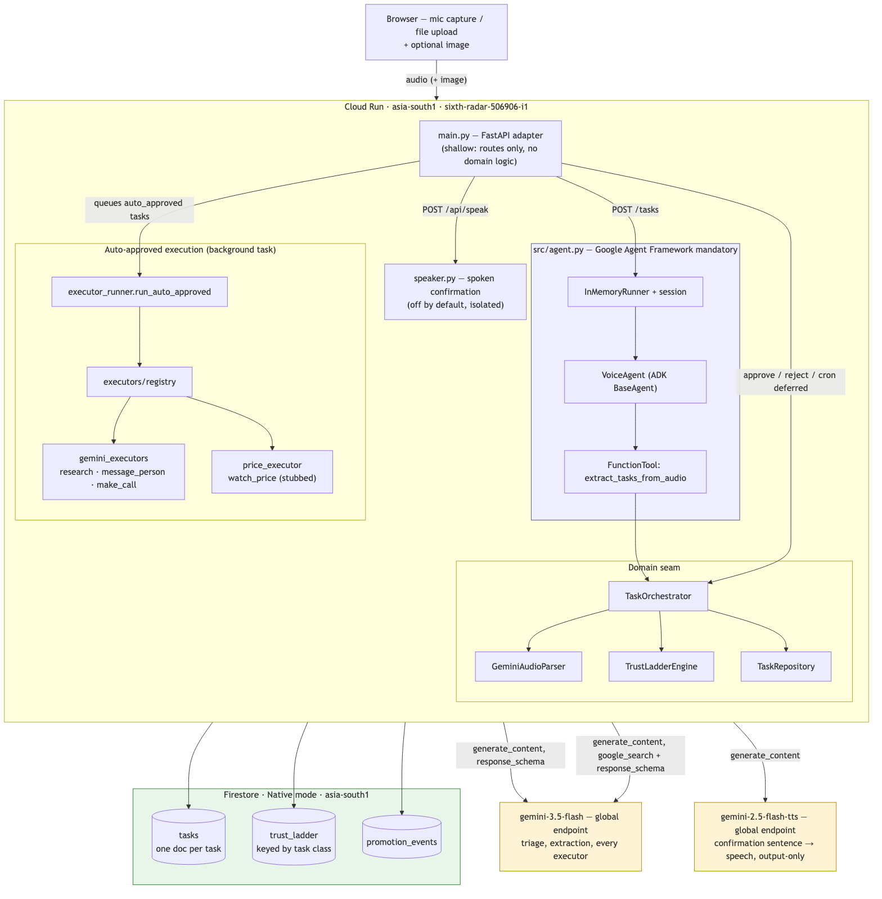

# Sollu: Voice-Note Errand Agent

Sollu is a voice-note errand agent built for the All Things Agentic Hackathon (Taskmaster track). 

A spoken voice note is sent to Gemini, decomposed into discrete tasks, and each task is triaged into a lane (`now`, `next`, `later`). The distinguishing feature is the **trust ladder**: the agent starts by asking permission for every task class (e.g. `message_person`, `make_call`, `watch_price`), and promotes a class to auto-execute once enough approvals have accrued. Rejections demote it back.

**Deployed:** <https://voice-agent-155260241110.asia-south1.run.app>

| Hackathon mandatory | How this repo meets it |
|---|---|
| Gemini 3.5+ | `gemini-3.5-flash` — triage, extraction, every executor (see [Models](#models)) |
| One Google Agent Framework | `google-adk` — `src/agent.py`'s `VoiceAgent` sits on the live `POST /tasks` path (see [Architecture](#architecture)), it's not a standalone demo file |
| One Google Cloud infra service | Cloud Run (compute) + Firestore Native mode (state), both in `asia-south1` |

## Architecture



Full diagram source, the trust-ladder state chart, and the reasoning behind
the region/model split live in [`docs/architecture.md`](docs/architecture.md).

## Models

| Purpose | Model |
|---|---|
| Triage, extraction, and every executor | `gemini-3.5-flash` |
| Spoken confirmation only | `gemini-2.5-flash-tts` |

All reasoning runs on **`gemini-3.5-flash`**. The secondary model is output-only: it is
handed one finished sentence, built in Python from counts the pipeline has already
computed, and reads it aloud. It never touches triage, extraction, execution, or the
trust ladder, it never receives the audio or a transcript, and if it fails the app is
unchanged — spoken confirmation is off by default and degrades silently to the text
summary.

## What approval actually does

Approving a task runs an executor for its class, and the artifact appears on the card.

| Class | Executor | Real or stub |
|---|---|---|
| `research` | `gemini-3.5-flash` with Google Search grounding | real, web-grounded |
| `message_person` | `gemini-3.5-flash` draft message | **draft only — never sent** |
| `make_call` | `gemini-3.5-flash` call script | **script only — no call placed** |
| `watch_price` | Deferred condition evaluator | **stubbed price source** |
| `other` | none | reports `no_executor` |

Grounding is reported from the response's `grounding_metadata`, never inferred from the
prose, so a "Web-grounded" tag means a search actually ran. `GET /api/classes` exposes
each class's executor status.

Manual approval executes inline. Auto-approval executes in a background task so upload
latency stays flat — a grounded research call takes ~10–17s and runs per task — and the
card shows an `executing` state until the artifact lands.

## External Integrations via MCP (Model Context Protocol)

Sollu is designed to execute real-world tasks across personal productivity tools (like Notion, Google Sheets, Todoist, and Apple Notes). However, rather than building custom, brittle API integrations and complex OAuth flows into the core codebase, we adopted the **Model Context Protocol (MCP)**.

By leveraging the native MCP support (`McpToolset`) built into the `google-adk` framework:
- **Plug-and-play Autonomy**: The agent acts as an MCP client. It dynamically connects to MCP servers, discovers their tools, and allows `gemini-3.5-flash` to use them directly (e.g., dynamically calling a Notion `add_database_row` tool when a user logs an expense).
- **Reduced Deploy Risk**: We avoid expanding dependencies and hardcoding external service credentials inside the Cloud Run deployment.
- **Maximum Agentic Capability**: This approach proves that the agent can generalize to arbitrary external environments simply by passing the parsed intent to an LLM equipped with an MCP toolset, completely bypassing the need for boilerplate integration code.

## Input

A voice note can be recorded in the browser or uploaded as a file. An optional image
travels in the **same** `gemini-3.5-flash` request as a second content part, and is
treated as supporting evidence for what the speaker said rather than a second source of
tasks; what it contributed is recorded in `source` and `evidence`.

## Safety and Guardrails

Sollu's safety story is inherently built into its core mechanic—the **Trust Ladder**. Rather than bolting on an opaque guardrails layer, Sollu provides verifiable, progressive autonomy:

- **No Implicit Execution**: Nothing irreversible executes without explicit user approval. All new task classes start at a baseline of `pending_approval`.
- **Earned Autonomy**: Autonomy is earned strictly per-class (e.g., authorizing calendar access does not authorize making phone calls). 
- **Instant Revocation**: A single rejection of an auto-executed task serves as a strong demotion signal, instantly resetting the agent's autonomy for that class back to zero.
- **Secure Asynchronous State Mutation**: Deferred lane evaluation relies on a protected HTTP push endpoint. The `POST /api/cron/deferred` route is strictly secured behind an `X-Cron-Secret` header to prevent unauthenticated mutation of task states. External condition evaluators (such as flight prices or weather APIs) are structurally stubbed to guarantee deterministic execution for the demo without compromising the evaluation mechanic.
- **Full Observability**: Every autonomy change—promotions, demotions, and ladder consultations, and deferred task checks—is logged with strict correlation IDs, providing a fully auditable lifecycle of every voice note.

*Note on Architecture: The trust ladder directly influences the triage pipeline. The triage logic natively consults the ledger before a task is even scheduled, directly mapping user-granted authority to system execution boundaries.*

## Setup (local)

Prerequisites: Python 3.11+, [`uv`](https://docs.astral.sh/uv/), Node 18+ (frontend only),
a GCP project with **Vertex AI** and **Firestore (Native mode)** enabled, and
[Application Default Credentials](https://cloud.google.com/docs/authentication/provide-credentials-adc)
for that project (`gcloud auth application-default login`).

```bash
git clone <this repo> && cd voice-agent
cp .env.example .env        # fill in GOOGLE_CLOUD_PROJECT, CRON_SECRET
uv sync                     # installs from pyproject.toml / uv.lock

```bash
cd frontend && npm install && npm run build && cd ..
uv run uvicorn main:app --reload --port 8080
```

Open `http://localhost:8080` — the backend serves the built React SPA from `frontend/dist`. To run with hot-reload during development:

```bash
cd frontend && npm run dev     # Vite dev server with hot reload
```

## Deploy (Cloud Run)

`requirements.txt` is gitignored — the Cloud Run buildpack needs it, so a clean
clone must regenerate it from the committed `uv.lock` **before every deploy**:

```bash
uv export -o requirements.txt --no-hashes && sed -i '' '/^-e \.$/d' requirements.txt

gcloud run deploy voice-agent \
  --source . \
  --project <your-gcp-project> \
  --region asia-south1 \
  --allow-unauthenticated \
  --set-env-vars GOOGLE_CLOUD_PROJECT=<your-gcp-project>,GOOGLE_CLOUD_LOCATION=asia-south1,GOOGLE_GENAI_USE_VERTEXAI=TRUE,CRON_SECRET=<your-secret>
```

No `Dockerfile` — Cloud Run's buildpack builds directly from `--source .`.
If your local network has no working IPv6 route to Google (Python/gcloud hang
for minutes on first connection while `curl` doesn't), deploy from
[Cloud Shell](https://cloud.google.com/shell) instead, or run
`networksetup -setv6off Wi-Fi` locally.

## Testing

```bash
uv run python -m unittest discover -s tests    # unit tests — the orchestrator, trust ladder, executor seams
uv run python scripts/positive_control.py --runs 5   # gate: real audio through the production parser, checks count+lane+class stability
uv run python scripts/test_agent.py                  # smoke test: one voice note through the full ADK-wired path (writes real Firestore docs)
```
