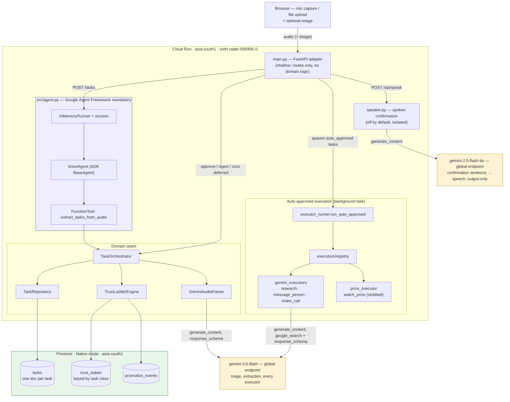
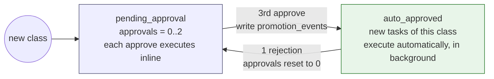

# Architecture

Sollu: a voice note goes in, Gemini decomposes it into tasks, and each task
walks a per-class **trust ladder** that decides whether it executes now or
waits for a human. Deployed on Cloud Run: <https://voice-agent-155260241110.asia-south1.run.app>

Rendered images for the submission form: [`architecture-system.png`](architecture-system.png)
and [`architecture-trust-ladder.png`](architecture-trust-ladder.png) (regenerate
with `npx -p @mermaid-js/mermaid-cli mmdc -i docs/architecture.md -o
docs/architecture.png -b white --scale 2` after editing a diagram below, then
rename the `-1`/`-2` output files it produces).

## System

Notes that matter for judging:

- **Google Agent Framework mandatory**: `main.py` calls `src/agent.run_voice_agent()`,
  not the orchestrator directly. The ADK `Runner` and `VoiceAgent` sit on the live
  request path — this is not a demo-only wrapper.
- **Model split**: all reasoning (triage, extraction, every executor) runs on
  `gemini-3.5-flash`. `gemini-2.5-flash-tts` only voices a sentence already built
  in Python from counts the pipeline computed — it never sees audio, transcript,
  or task text, and its failure degrades silently to the text summary.
- **Region split**: Cloud Run and Firestore run in `asia-south1`; both models are
  called against the `global` endpoint, because `gemini-3.5-flash` is only
  available in `asia-south1` as Single Zone Provisioned Throughput (not reachable
  pay-as-you-go). Infra region and model region are independent decisions.
- **Firestore layout**: one document per task (no shared mutable blob, so
  concurrent writers don't contend), approval counts in `trust_ladder` keyed by
  class, promotions appended to `promotion_events`.
- **Stubs, stated plainly**: `message_person`/`make_call` produce drafts —
  nothing is sent or called. `watch_price` reads a deterministic canned price.
  `research` is the one executor that is fully real and web-grounded.

## Trust ladder (the differentiator)

Each task **class** (`message_person`, `make_call`, `research`, `watch_price`, …)
carries its own independent approval count — approving a `research` task never
grants autonomy to `make_call`.

Rejecting a task that is still `pending_approval` leaves the class exactly
where it was — the ladder only moves on a promotion (3rd approval) or a
demotion (1 rejection while `auto_approved`).
